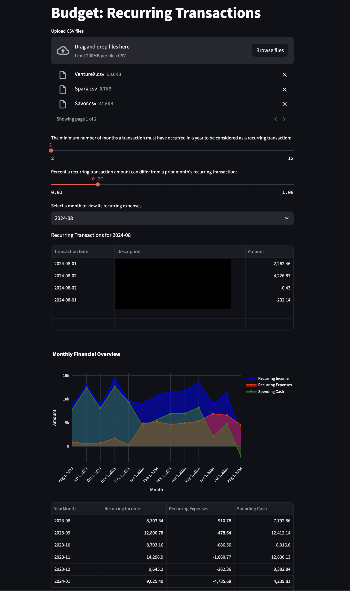

# LLMBudget

LLMBudget is a financial data analysis tool designed to identify and visualize recurring transactions in your financial statements. It leverages Streamlit for the user interface, Plotly for interactive visualizations, and various Python libraries for data processing and analysis.



## Features

- **Recurring Transaction Detection**: Identifies recurring transactions based on customizable parameters.
- **Interactive Visualization**: Provides an interactive line plot of your recurring income, expenses, and spending cash flow.
- **CSV Upload**: Easily upload your CSV financial statements for analysis.
- **Customizable Settings**: Adjust parameters such as similarity thresholds and tolerance levels to fine-tune the detection of recurring transactions.

## Getting Started

### Prerequisites

- Python 3.7 or higher
- The following Python libraries:
  - `streamlit`
  - `pandas`
  - `plotly`
  - `matplotlib`
  - `seaborn`
  - `fuzzywuzzy`
  - `Levenshtein`

### Installation

1. Clone the repository:

   ```bash
   git clone https://github.com/ericzacharia/LLMBudget.git
   cd LLMBudget


Usage

	•	Upload your financial statement CSV files.
	•	Adjust the sliders to customize the detection of recurring transactions.
	•	View the interactive plot showing your recurring income, expenses, and spending cash flow.

Example


Contributing

Contributions are welcome! Please fork this repository, make your changes, and submit a pull request.

License

This project is licensed under the MIT License - see the LICENSE file for details.

Contact

For any inquiries, please contact Eric Zacharia at eric@unsupervisedbias.com.